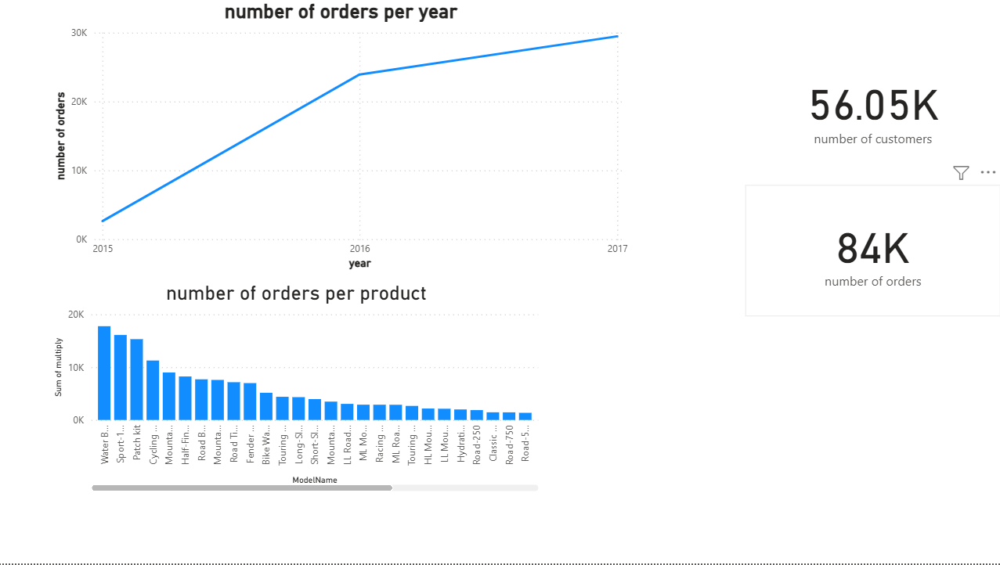

# Azure End-to-End Data Engineering Project: AdventureWorks Analytics

A complete Azure-based data engineering project that builds a modern data pipeline to analyze AdventureWorks sales data. This solution follows the Bronze → Silver → Gold architecture and delivers interactive Power BI dashboards powered by curated data.

---

## 📚 Table of Contents
- [Overview](#overview)
- [Architecture](#architecture)
- [Tech Stack](#tech-stack)
- [Pipeline Stages](#pipeline-stages)
- [Power BI Dashboard](#power-bi-dashboard)
- [Contact](#contact)

---

## 🧾 Overview

This project demonstrates a real-world Azure data engineering pipeline using the AdventureWorks dataset. The goal is to automate data ingestion, cleaning, transformation, and KPI generation using Azure services. Final outputs are consumed via Power BI dashboards.

---

## 🏗️ Architecture

AdventureWorks CSV files
↓
Azure Data Factory (ADF)
↓
Azure Data Lake Storage Gen2 (Bronze / Silver / Gold)
↓
Azure Databricks (PySpark Transformation)
↓
Azure Synapse Serverless (External Tables)
↓
Power BI (DirectQuery)

---

## 🛠️ Tech Stack

- **Azure Data Factory** – for ingestion and orchestration
- **Azure Data Lake Storage Gen2** – for scalable raw and processed data storage
- **Azure Databricks** – for cleaning, transformation, and aggregations using PySpark
- **Azure Synapse Analytics (Serverless SQL Pool)** – for querying curated data via external tables
- **Power BI** – for building business dashboards and visualizations
- **Languages** – Python, SQL

---

## 🔁 Pipeline Stages

### 🟫 Bronze Layer
Raw CSV files ingested from AdventureWorks dataset using Azure Data Factory and stored in `raw/` folder in ADLS.

### ⚪ Silver Layer
Raw data cleaned, typed, deduplicated, and joined using Azure Databricks notebooks. Stored in `processed/` folder in ADLS in Parquet format.

### 🥇 Gold Layer
Aggregated KPIs such as monthly sales, customer lifetime value, and top products are computed. Stored in `curated/` folder in ADLS and exposed to Synapse via external tables.

### 📊 Power BI
Power BI connects directly to Synapse SQL views using DirectQuery for live reporting.

---

## 📊 Power BI Dashboard

- total customers
- total orders
- number of orders per year
- number of ordees per product

--------

- ## 👤 Contact

**Kamel Mostafa**  
📧 kamelmo284@gmail.com

